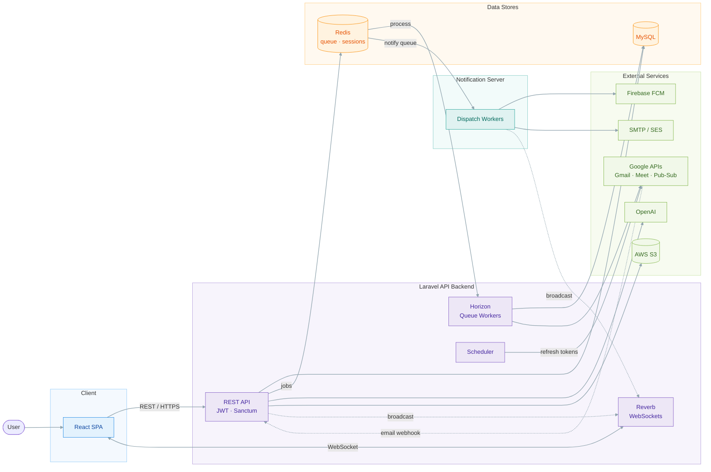
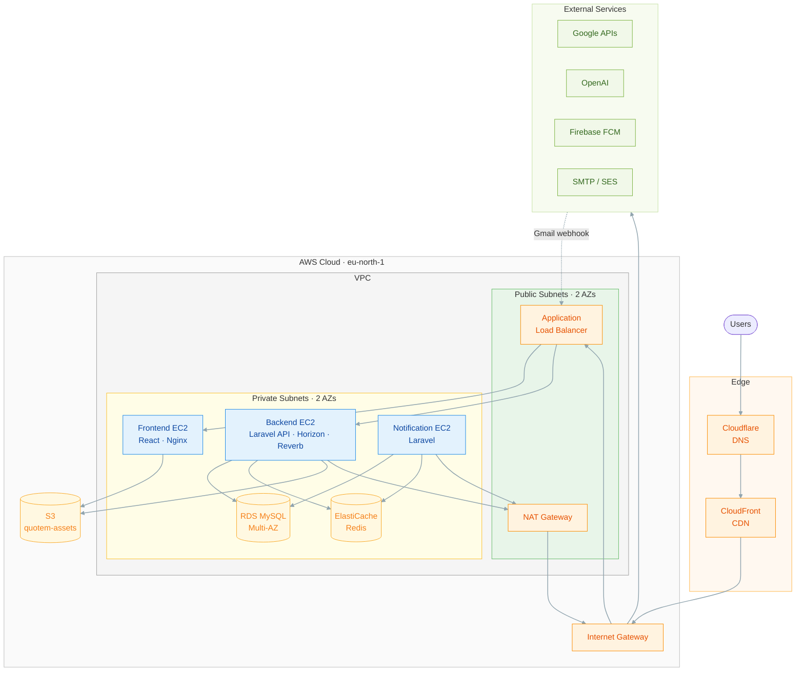

# QuoteM — System Architecture

## 1. Application Architecture

```mermaid
%%{init: {'flowchart': {'curve': 'basis', 'nodeSpacing': 45, 'rankSpacing': 70}}}%%
flowchart LR
    user([User])

    subgraph client[Client]
        spa[React SPA]
    end

    subgraph backend[Laravel API Backend]
        direction TB
        api[REST API<br/>JWT · Sanctum]
        reverb[Reverb<br/>WebSockets]
        workers[Horizon<br/>Queue Workers]
        cron[Scheduler]
    end

    subgraph notif[Notification Server]
        notifworker[Dispatch Workers]
    end

    subgraph data[Data Stores]
        direction TB
        mysql[(MySQL)]
        redis[(Redis<br/>queue · sessions)]
    end

    subgraph external[External Services]
        direction TB
        google[Google APIs<br/>Gmail · Meet · Pub-Sub]
        openai[OpenAI]
        fcm[Firebase FCM]
        mail[SMTP / SES]
        s3[(AWS S3)]
    end

    user --> spa
    spa -->|REST / HTTPS| api
    spa <-->|WebSocket| reverb

    api --> mysql
    api -->|jobs| redis
    redis -->|process| workers
    redis -->|notify queue| notifworker
    workers --> mysql

    api --> openai
    api --> s3
    workers --> google
    cron -->|refresh tokens| google
    google -.->|email webhook| api
    api -.->|broadcast| reverb

    notifworker --> fcm
    notifworker --> mail
    notifworker -.->|broadcast| reverb

    classDef client fill:#E3F2FD,stroke:#1E88E5,color:#0D47A1;
    classDef backend fill:#EDE7F6,stroke:#7E57C2,color:#4527A0;
    classDef notif fill:#E0F2F1,stroke:#26A69A,color:#00695C;
    classDef data fill:#FFF3E0,stroke:#FB8C00,color:#E65100;
    classDef external fill:#F1F8E9,stroke:#7CB342,color:#33691E;

    class spa client;
    class api,reverb,workers,cron backend;
    class notifworker notif;
    class mysql,redis data;
    class google,openai,fcm,mail,s3 external;

    style client fill:#F4F9FE,stroke:#90CAF9;
    style backend fill:#F7F4FC,stroke:#B39DDB;
    style notif fill:#F2FBFA,stroke:#80CBC4;
    style data fill:#FFF9F0,stroke:#FFCC80;
    style external fill:#F7FBF0,stroke:#C5E1A5;

    linkStyle default stroke:#90A4AE,stroke-width:1.5px;
```

## 2. AWS Deployment

```mermaid
%%{init: {'flowchart': {'curve': 'basis', 'nodeSpacing': 45, 'rankSpacing': 65}}}%%
flowchart TB
    users([Users])

    subgraph edge[Edge]
        direction LR
        r53[Cloudflare<br/>DNS]
        cf[CloudFront<br/>CDN]
    end

    subgraph aws[AWS Cloud · eu-north-1]
        igw[Internet Gateway]

        subgraph vpc[VPC]
            subgraph public[Public Subnets · 2 AZs]
                direction LR
                alb[Application<br/>Load Balancer]
                nat[NAT Gateway]
            end
            subgraph private[Private Subnets · 2 AZs]
                fe[Frontend EC2<br/>React · Nginx]
                be[Backend EC2<br/>Laravel API · Horizon · Reverb]
                ns[Notification EC2<br/>Laravel]
                rds[(RDS MySQL<br/>Multi-AZ)]
                redis[(ElastiCache<br/>Redis)]
            end
        end

        s3[(S3<br/>quotem-assets)]
    end

    subgraph ext[External Services]
        direction LR
        google[Google APIs]
        openai[OpenAI]
        fcm[Firebase FCM]
        email[SMTP / SES]
    end

    users --> r53 --> cf
    cf --> igw --> alb
    alb --> fe & be
    be & ns --> rds
    be & ns --> redis
    fe & be --> s3
    be & ns --> nat
    nat --> igw
    igw --> ext
    ext -.->|Gmail webhook| alb

    classDef net fill:#FFF3E0,stroke:#FB8C00,color:#E65100;
    classDef compute fill:#E3F2FD,stroke:#1E88E5,color:#0D47A1;
    classDef store fill:#FFF8E1,stroke:#F9A825,color:#F57F17;
    classDef external fill:#F1F8E9,stroke:#7CB342,color:#33691E;

    class r53,cf,igw,nat,alb net;
    class fe,be,ns compute;
    class rds,redis,s3 store;
    class google,openai,fcm,email external;

    style edge fill:#FFF8F0,stroke:#FFB74D;
    style aws fill:#FAFAFA,stroke:#BDBDBD;
    style vpc fill:#F5F5F5,stroke:#9E9E9E;
    style public fill:#E8F5E9,stroke:#66BB6A;
    style private fill:#FFFDE7,stroke:#FBC02D;
    style ext fill:#F7FBF0,stroke:#C5E1A5;

    linkStyle default stroke:#90A4AE,stroke-width:1.5px;
```

